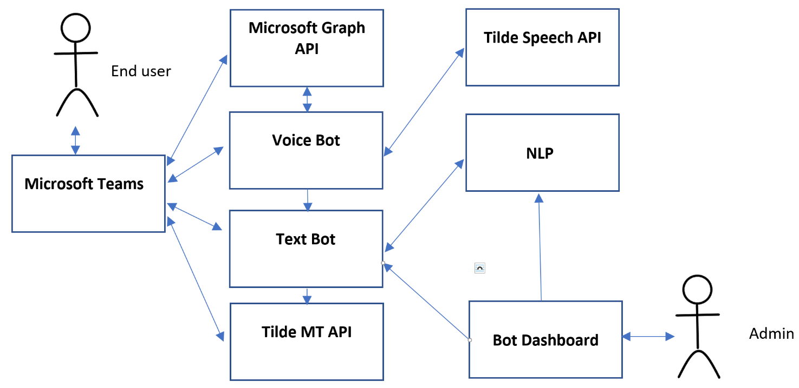
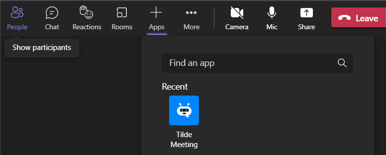
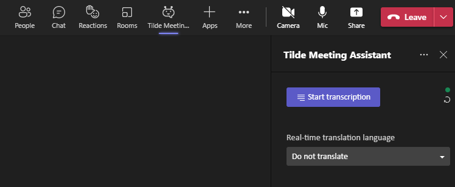
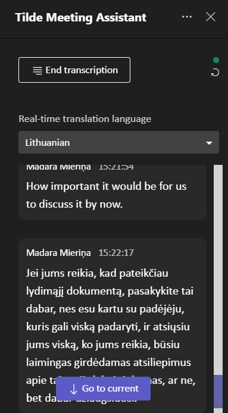

# PIP3_4_Prototype
This is the prototype created in activity 4 of the project "AI Assistant for Multilingual Meeting Management" (No. of the Contract/Agreement: 1.1.1.1/19/A/082)

Meeting Assistant can only be run on a Windows machine due to a dependency on Microsoft.Skype.Bots.Media library.

## Steps to set up:  
- Get an SSL certificate, install it on the machine.

- Register an application in Azure.  
Select Expose an API  
Set the Application ID URI to api://[your service url]/[app id]  
Add a scope with the name access_as_user  
Add client applications: 1fec8e78-bce4-4aaf-ab1b-5451cc387264, 5e3ce6c0-2b1f-4285-8d4b-75ee78787346  
These ids are for Teams desktop and mobile clients  
Go to API permissions, set up delegated permissions OnlineMeetings.Read, profile  
Also set up Application permission Call.JoinGroupCall.All  

- Register or acquire access to an Azure Bot - you will need App Id and Azure DirectLine Secret or URL to message the bot through a private directline  

Register a Teams application at dev.teams.microsoft.com  
At App features, add the Bot.  
At Single Sign-On enter the Application ID URI from the Expose an API step  
Set the configuration url to https://[your service url]/teamsapp/configure  

- Configure *appsettings.json*  

AadAppId, AadAppSecret, AadTenantId - Azure app parameters  
ServiceCname - Public domain name of this service (frontend)  
MediaServiceFQDN - Domain of the media service  
CertificateThumbprint - SSL thumbprint, certificate must be installed in the personal store and match the MediaServiceFQDN domain  
InstancePublicPort, InstanceInternalPort - Ports to use for media service  
CallSignalingPort - Port to use for the call signal  
Translation - Translation service credentials  
DirectLineSecret - Azure Bot directline secret  
OffDirectLineUrl - If the bot is hosted behind a private directline instance, takes priority over DirectLineSecret  
TranscriptFolder - Path for saving transcripts; relative  
BrowserRedirectUrl - Where to redirect if the app frontend is accessed without teams meeting parameters (e.g. through a browser)  
ASRConfiguration - Credentials for Automatic Speech Recognition service; SilenceTimeout indicates how soon to send End of Speech marker when speaker stops talking. Effective minimum value is 100ms  
Authentication - Set of valid auth keys and e-mail that will be shown in the Teams App for where to get a key  

## Architecture
The Tilde Meeting Assistant prototype consists of six components – a Microsoft Teams application, a voice bot, a text/logic bot (or the Virtual Assistant that can be cutomized using Tilde Bot Dashboard), a machine translation (MT) service, a speech recognition service, and a natural language processing service. A user can connect the voice bot to a meeting within the user interface (UI) of the Teams application. The voice bot connects to the Teams meeting using the Microsoft Graph API.

## Using Virtual Assistant in Microsoft Teams application
To add the Tilde Meeting Assistant to an ongoing meeting, select the “+Apps” menu item in the Teams user interface.

This action will open a list of available applications. If the Tilde Meeting Assistant is not visible, click on the “More apps” link. After finding the Tilde Meeting Assistant application, the configuration screen will show up.
If the Tilde Meeting Assistant is succesfuly added to the meeting, in the top bar you will see the Tilde Meeting Assistant icon.

Choose the Tilde Meeting Assistant tab and click on “Start transcription” button to start the transcript of the teams’ spoken dialog.

Real-time translation language can be changed at any time using the language dropdown. Meeting language is shared by everyone in the meeting, but Real-time translation language can be selected on a per-user basis. If a real-time translation language is selected, then complete sentences are run through machine translation and the translated version is shown to the user.

